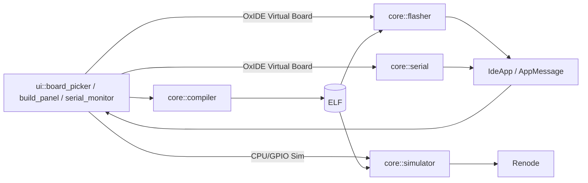
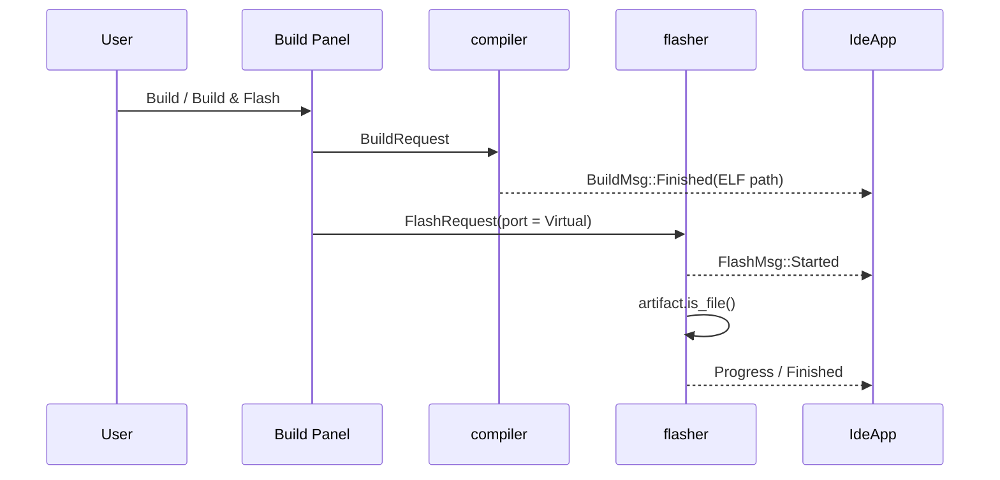
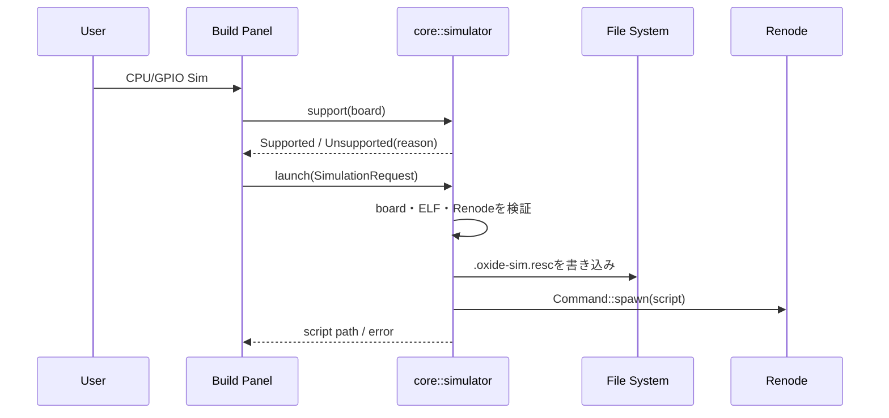

# 仮想マイコン アーキテクチャ設計書

> 実装逆引き版
> 対象: ALLoIDE 0.1.0 / 2026-08-11
> 根拠: `src/core/simulator.rs`、`src/core/serial.rs`、`src/core/flasher.rs`、`src/ui/build_panel.rs`

## 1. 目的と範囲

ALLoIDEの仮想マイコン環境は、実機なしで次の2段階の試験を行うための機能である。

1. 全ボード共通のIDE操作試験: 仮想Flash、仮想Serial、Serial Plotter
2. 対応ボードのファームウェア試験: RenodeによるELF命令実行とLED GPIO観測

仮想環境は `OxIDE Virtual Board` という特別なポート名で選択する。実機用のビルド処理は置き換えず、選択ボード向けの実ELFをそのまま使用する。

## 2. 実装から逆引きした構成



| 実装箇所 | 責務 |
|---|---|
| `src/core/serial.rs` | 仮想ポート列挙、接続、周期データ、echo、切断通知 |
| `src/core/flasher.rs` | 仮想Flashの成果物確認、進捗、成功・失敗通知 |
| `src/core/simulator.rs` | 対応判定、Renodeスクリプト生成、Renode起動 |
| `src/ui/board_picker.rs` | 仮想ポート選択状態の表示 |
| `src/ui/build_panel.rs` | ELF探索、CPU/GPIO Simボタン、結果表示 |
| `src/app.rs` | Flash/SerialメッセージをUI状態へ反映 |

## 3. 共通識別子と契約

### 3.1 仮想ポート

`core::serial::VIRTUAL_PORT_NAME` の値は `OxIDE Virtual Board` である。`list_ports()` はOSから取得した実ポート一覧へ、この値を重複なしで追加する。

UI、Flash、Serialは同じ定数を参照する。文字列を各層へ重複定義しないことで、仮想経路の判定を一元化している。

### 3.2 CPU/GPIO対応判定

```rust
pub enum SimulationSupport {
    Supported {
        platform: &'static str,
        gpio: &'static str,
        pin: u8,
    },
    Unsupported(&'static str),
}
```

`support(&BoardKind)` が全 `BoardKind` を網羅して、Renodeプラットフォーム、GPIOコントローラ、LEDピン、または非対応理由を返す。UIとスクリプト生成はこの契約を共有し、別々の対応表を持たない。

### 3.3 起動要求

```rust
pub struct SimulationRequest {
    pub board: BoardKind,
    pub artifact: PathBuf,
}
```

`launch()` は `anyhow::Result<PathBuf>` を返す。成功値は生成した `.oxide-sim.resc` のパスであり、UIはこれをBuild Logへ表示する。

## 4. データフロー

### 4.1 Build → 仮想Flash



仮想Flashは外部書き込みツールを起動しない。ELFが通常ファイルであることを確認し、成功または失敗を既存の `FlashMsg` 契約で通知する。

### 4.2 仮想Serial

`connect_async()` はポート名が仮想ポートと一致した場合、物理 `serialport` を開かず `run_virtual_serial()` を実行する。

- 接続時: `SerialMsg::Connected`
- 250msごと: `SerialMsg::Line("sensor:N")`、Nは0〜99
- 送信時: `SerialMsg::Line("echo:<input>")`
- Disconnectまたはコマンドチャネル切断時: `SerialMsg::Disconnected`

非同期通信は既存方針どおり `crossbeam-channel` に統一されている。`sensor:N` は既存のプロッタ解析形式 `name:value` を再利用する。

### 4.3 CPU/GPIOシミュレーション



Renodeは別プロセスとして起動する。ALLoIDEは子プロセス終了を待たず、起動後のCPU状態やGPIO状態はRenode側で観測する。

## 5. Renodeスクリプト

生成先はELFと同じディレクトリの `.oxide-sim.resc` である。内容は対応表から組み立てる。

```text
mach create
machine LoadPlatformDescription @<platform>
machine LoadPlatformDescriptionFromString "led: Miscellaneous.LED @ <gpio> <pin>"
sysbus LoadELF @"<artifact>"
start
```

Windowsのパス区切りは `/` へ正規化し、`"` をエスケープする。Linuxで有効な改行入りファイル名はRenode命令注入につながるため拒否する。

## 6. CPU/GPIO対応表

対応条件は「ALLoIDEプリセットのMCUと一致する公式Renodeプラットフォームがあり、対象LEDのGPIOモデルも存在すること」である。近似MCUは使用しない。

| BoardKind | 状態 | Renode platform | LED GPIO |
|---|---|---|---|
| `Samd21` | 対応 | `atsamd21j17d-aft.repl` | `gpio_a` 17 (PA17) |
| `Stm32F1` | 対応 | `stm32f103.repl` | `gpioPortC` 13 (PC13) |
| `Stm32F7` | 対応 | `stm32f746.repl` | `gpioPortB` 7 (PB7) |
| `Stm32H7` | 対応 | `stm32h743.repl` | `gpioPortB` 14 (PB14) |
| `Stm32G0` | 対応 | `stm32g0.repl` | `gpioPortA` 5 (PA5) |
| `NrF52840` | 対応 | `nrf52840.repl` | `gpio0` 13 (P0.13) |
| `Samd51` | 非対応 | CPUモデルのみ | GPIOモデルなし |
| その他21種類 | 非対応 | 一致モデルなし | — |

「その他21種類」の内訳はAVR 4種、Raspberry Pi 3種、Arduino Due、STM32F4/L4、nRF51822、micro:bit V2、Teensy 4、ESP32系6種、GD32VF103、CH32V003である。

## 7. UI状態と表示条件

CPU/GPIO操作は次の条件をすべて満たす場合だけ表示される。

1. 選択ポートが `OxIDE Virtual Board`
2. 選択した `BoardKind` が `SimulationSupport::Supported`
3. `last_dist_path` 内に拡張子 `.elf` の成果物が存在する

非対応ボードでは `CPU/GPIO Sim: 非対応` を表示し、hover textへcore契約の理由を表示する。ELF未生成時はボタンを表示しない。

## 8. エラー設計

coreの失敗は `anyhow::Result` で返し、UIはBuild Logへ `[ERROR] CPU/GPIO simulation: ...` として追記する。

| 検査 | エラー条件 |
|---|---|
| 対応判定 | `SimulationSupport::Unsupported` |
| ELF | パスが通常ファイルではない |
| Renode | `renode` / Windowsの `Renode` がPATHにない |
| 出力先 | ELFに親ディレクトリがない、またはrescを書き込めない |
| パス安全性 | ELFパスにCR/LFが含まれる |
| プロセス | Renodeをspawnできない |

## 9. スレッドとライフサイクル

| 機能 | 実行方式 | 終了方法 |
|---|---|---|
| 仮想Flash | `flash_async()` のバックグラウンドスレッド | Finished送信後に終了 |
| 仮想Serial | `connect_async()` のバックグラウンドスレッド | Disconnectまたはチャネル切断 |
| Renode | OS子プロセス | Renode側で終了 |

Renode起動結果には専用 `AppMessage` を追加していない。起動処理は短い検証・ファイル書き込み・spawnだけであり、結果は呼び出し元へ同期的に返す。

## 10. テスト戦略

### `src/core/simulator.rs` の単体テスト

- 全 `BOARD_PRESETS` がSupportedまたは理由付きUnsupportedになること
- Supportedが6種類であること
- 6種類すべてのplatform、GPIO、pinが生成スクリプトへ入ること
- 非対応理由が空でないこと
- 改行入りパスを拒否すること

### `tests/integration_virtual.rs` の統合テスト

- 仮想ポートが1件だけ列挙されること
- Connected → echo → Disconnectedの順で通知されること
- 実在ELFに対する仮想FlashがStarted → Progress → successful Finishedを返すこと

Renode実行ファイルは開発環境に必須とせず、スクリプト生成までを自動テストする。Renode本体との互換性はRenode導入済み環境で別途確認する。

## 11. 現在の制約

- RenodeのインストールとPATH設定は利用者が行う。
- Renode子プロセスの停止・再起動・状態取得をALLoIDEから制御しない。
- GPIO観測対象は各テンプレートのLED 1ピンのみ。
- 仮想SerialはRenode UARTと接続されず、独立したテストデータ生成器である。
- 実時間、クロック誤差、電気特性、未モデル化周辺回路は再現しない。
- 非対応ボードを近似CPUで実行しない。

## 12. 拡張時の変更点

新しいCPU/GPIO対応を追加する場合、原則として変更箇所は `support()` の1エントリと対応テストである。

追加前に次を確認する。

1. ALLoIDEプリセットの正確なMCUに対応するRenode platformがある。
2. ELFのロードアドレスとメモリマップが一致する。
3. テンプレートのLED GPIOコントローラとpinがRenodeに存在する。
4. 生成rescをWindowsとLinuxのRenodeで起動できる。
5. LEDの状態変化を実機または既知の期待値と比較する。

UART統合やRenode停止制御が必要になった場合は、専用のSimulation message/handleを追加する。その必要が生じるまでは、現在の同期 `launch()` 契約を維持する。
